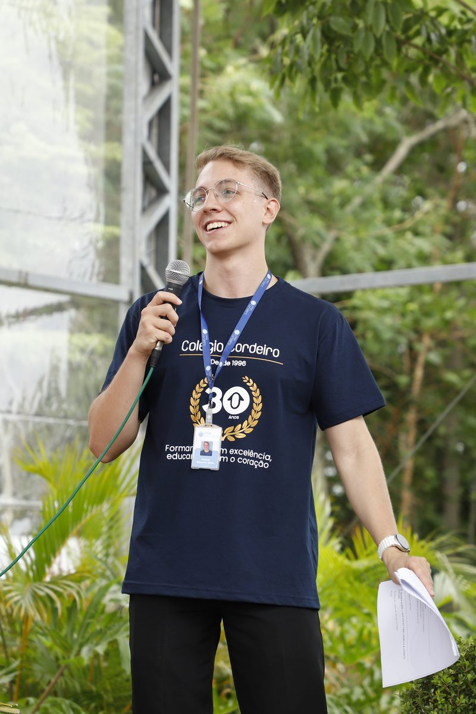

# 🚌 SoulMove — Sprint 03 | Front-End Design Engineering (FIAP)

<div align="center">
  
  <h3>Mobilidade sustentável que gera impacto, reconhecimento e recompensa 🌱</h3>
</div>

---

## 📋 Descrição do Projeto

O **SoulMove** é uma solução desenvolvida para o **Challenge Soul Up (FIAP 2026)** pelo grupo **Un-glitch tech**. A proposta transforma mobilidade urbana em impacto sustentável mensurável: o usuário registra jornadas de transporte público, o sistema valida os trajetos de forma segura (localização, tempo e padrões de movimentação) e converte o CO₂ economizado em **Pontos Soul Up**, trocáveis por descontos em passagens e benefícios com parceiros.

Nesta **Sprint 03**, o site desenvolvido nas sprints anteriores (HTML, CSS e JavaScript) foi totalmente **migrado para uma SPA moderna** com **React + Vite + TypeScript**, mantendo o layout e a identidade visual originais, agora com arquitetura de componentes reutilizáveis, navegação com React Router, estilização 100% em TailwindCSS e formulário validado com React Hook Form.

---

## 🛠️ Tecnologias Utilizadas

| Tecnologia | Função no projeto |
|---|---|
| ⚛️ **React 18** | Construção da interface e componentização |
| ⚡ **Vite 6** | Build, bundling e servidor de desenvolvimento |
| 🟦 **TypeScript** | Tipagem estática em componentes, props e formulários |
| 🎨 **TailwindCSS 4** | Estilização de toda a interface e responsividade |
| 🧭 **React Router DOM 7** | Navegação SPA com rotas estáticas e dinâmicas |
| 📝 **React Hook Form** | Validação do formulário de contato |
| 🐙 **Git / GitHub** | Versionamento e colaboração da equipe |

---

## 📁 Estrutura de Pastas do Projeto

```
soulmove-sprint3/
├── public/
│   └── img/                    # Imagens do projeto (logo, fotos, arquitetura)
├── src/
│   ├── components/             # Componentes reutilizáveis
│   │   ├── Header.tsx          # Cabeçalho com menu responsivo (useState)
│   │   ├── Footer.tsx          # Rodapé do site
│   │   ├── Layout.tsx          # Estrutura base + título dinâmico (useEffect)
│   │   ├── Botao.tsx           # Botão com variantes de estilo
│   │   ├── Grade.tsx           # Grade genérica reutilizável (generics do TypeScript)
│   │   ├── PageHero.tsx        # Cabeçalho de página reutilizável (props)
│   │   ├── FeatureCard.tsx     # Card de funcionalidade (useNavigate)
│   │   ├── FaqItem.tsx         # Item de pergunta/resposta (useState)
│   │   ├── IntegranteCard.tsx  # Card de integrante da equipe
│   │   └── CalculadoraCarbono.tsx # Calculadora interativa de CO₂ (useState)
│   ├── pages/                  # Páginas da aplicação (rotas)
│   │   ├── Home.tsx            # Página inicial
│   │   ├── Integrantes.tsx     # Quem somos
│   │   ├── Sobre.tsx           # Sobre nós / contexto do projeto
│   │   ├── Faq.tsx             # Perguntas frequentes
│   │   ├── Contato.tsx         # Formulário com React Hook Form
│   │   ├── Solucao.tsx         # Página da solução do projeto
│   │   ├── SolucaoDetalhe.tsx  # Rota dinâmica /solucao/:id (useParams)
│   │   └── NotFound.tsx        # Página 404
│   ├── data/                   # Dados tipados da aplicação
│   ├── types/                  # Interfaces TypeScript
│   ├── hooks/                  # Custom hooks (useImpactoCarbono com useMemo)
│   ├── utils/                  # Funções tipadas de cálculo de impacto de carbono
│   ├── App.tsx                 # Definição das rotas (React Router)
│   ├── main.tsx                # Ponto de entrada da aplicação
│   └── index.css               # Tailwind + tema (cores da identidade visual)
├── index.html
├── package.json
├── vite.config.ts              # Configuração Vite + plugins React e Tailwind
└── tsconfig.json               # Configuração TypeScript
```

---

## 👥 Autores e Créditos — Grupo Un-glitch tech

| Foto | Nome | RM | Turma | GitHub | LinkedIn |
|---|---|---|---|---|---|
|  | Allyson Victor | 571046 | 1TDSPV | [GitHub](https://github.com/Ally7574) | [LinkedIn](https://www.linkedin.com/in/allyson-victor-0804a9313/) |
|  | Carlos Eduardo Oliveira Silva | 569103 | 1TDSPV | [GitHub](https://github.com/ceduardoos) | [LinkedIn](https://www.linkedin.com/in/carlos-eduardo-silva-573550158) |
|  | Kaique Ziantoni | 570294 | 1TDSPV | [GitHub](https://github.com/KaiqueZiantoni) | [LinkedIn](https://www.linkedin.com/in/kaiqueziantoni/) |
|  | Marcus Vinicius Costa | 573058 | 1TDSPV | [GitHub](https://github.com/Costa-Marcus) | [LinkedIn](https://www.linkedin.com/in/costa-marcus-v/) |
|  | Silas Oliveira | 571506 | 1TDSPV | [GitHub](https://github.com/SilasAngare1) | [LinkedIn](https://www.linkedin.com/in/silas-angare-pedroso-de-oliveira-55004430a/) |

---

## 🖼️ Imagens do Projeto

<div align="center">
  
  <p><em>Arquitetura da solução SoulMove</em></p>
</div>

---

## 🔗 Links

- **Repositório GitHub:** https://github.com/KaiqueZiantoni/Sprint-Front-FIAP
- **Vídeo de apresentação (YouTube):** https://www.youtube.com/watch?v=4yXOEV7NeY0

## 🚀 Como Usar (Executar Localmente)

**Pré-requisito:** Node.js 18+ instalado.

```bash
# 1. Clone o repositório
git clone https://github.com/KaiqueZiantoni/Sprint-Front-FIAP.git

# 2. Acesse a pasta do projeto
cd Sprint-Front-FIAP

# 3. Instale as dependências
npm install

# 4. Execute em modo de desenvolvimento
npm run dev
```

Acesse **http://localhost:5173** no navegador.

Para gerar a versão de produção:

```bash
npm run build
npm run preview
```

---

## 📬 Contato

- **E-mail:** contato@soulmove.com
- Ou envie sua mensagem pela página **Contatos** do site.

---

<div align="center">
  <p>Projeto desenvolvido para a disciplina de <strong>Front-End Design Engineering — FIAP</strong> 🎓</p>
</div>
